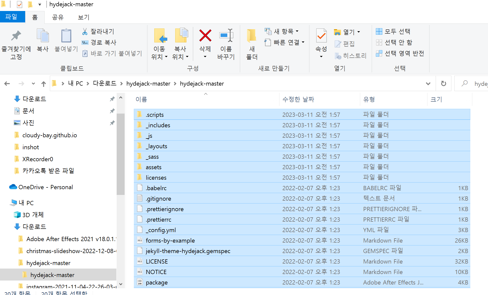
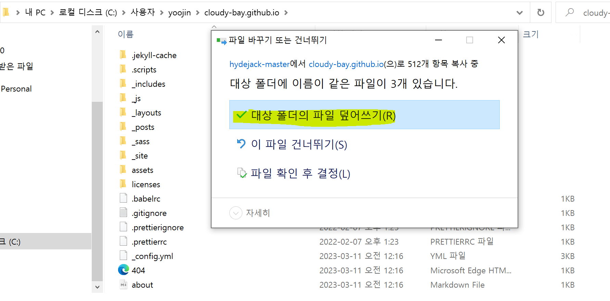
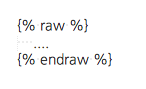

# Github 블로그 만들기(2)

- window 환경
- Github 블로그 만들기(1) 글 후행

---

## 1. jekyll 테마 선택하기

### 1.1 jekyll theme 선택 사이트

- **[jamstackthemes.dev](https://jamstackthemes.dev/ssg/jekyll/)**
- **[jekyllthemes.org](http://jekyllthemes.org/)**
- **[jekyllthemes.io](https://jekyllthemes.io/)**
- **[jekyll-themes.com](https://jekyll-themes.com/)**

들어가서 마음에 드는 테마를 선택하면 된다. 내가 선택한건 [hydejack](https://jekyll-themes.com/hydejack/) 테마(깔끔, 반응성.. 화려한 게 좋다 😉)

### 1.2 테마 적용하기

- 다운로드 받은 파일을 압축해제 한다.

- Local git repository에 복사한다
  - ex
    - 다운받은 테마 소스 복사
    
    - 
    
    - Local git repository에 복사
    
    - 겹치는 파일 존재할 경우 덮어쓰기 적용
    
    - 
    
    - jekyll command 입력
    
      - ```bash
        bundle install
        bundle exec jekyll serve 
        ```
    
      - ❗ 설치하다보면 아래와 같은 Liquid Exception: Liquid syntax error 가 날 수 있다
    
        - ex
    
          ```bash
          C:\Users\yoojin\cloudy-bay.github.io>bundle exec jekyll serve
          Configuration file: C:/Users/yoojin/cloudy-bay.github.io/_config.yml
                      Source: C:/Users/yoojin/cloudy-bay.github.io
                 Destination: C:/Users/yoojin/cloudy-bay.github.io/_site
           Incremental build: disabled. Enable with --incremental
                Generating...
                 Jekyll Feed: Generating feed for posts
            Liquid Exception: Liquid syntax error (C:/Users/yoojin/cloudy-bay.github.io/_includes/styles/style.scss line 17): Unknown tag 'include_cached' included in assets/css/hydejack-9.1.6.css
                              ------------------------------------------------
                Jekyll 4.3.2   Please append `--trace` to the `serve` command
                               for any additional information or backtrace.
                              ------------------------------------------------
          ```
    
        - 해결방법
    
        Jekyll 에서 사용되는 liquid가 `{{`와 `}}`를 escape 문자로 사용합니다. 문서에 {{, }} 가 들어 있는 경우 jekyll engine이 경고 메시지를 출력하고, {{ … }} 사이에 있는 내용은 무시된다. 
    
        해당 내용을 liquid parsing을 하지 않기 위해서는 문장 앞뒤로 다음과 같은 `, { %endraw% }` `tag를 추가해 주면 warning과 출력 문제를 해결할 수 있다.
    
        
    
        