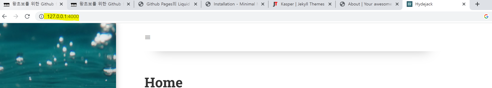

# Github 블로그 만들기(2)

- window 환경
- Github 블로그 만들기(1) 글 후행

---

## 1. jekyll 테마 선택하기

### 1.1 jekyll theme 선택 사이트

- **[jamstackthemes.dev](https://jamstackthemes.dev/ssg/jekyll/)**
- **[jekyllthemes.org](http://jekyllthemes.org/)**
- **[jekyllthemes.io](https://jekyllthemes.io/)**
- **[jekyll-themes.com](https://jekyll-themes.com/)**

들어가서 마음에 드는 테마를 선택하면 된다. 내가 선택한건 [hydejack](https://jekyll-themes.com/hydejack/) 테마(깔끔, 반응성.. 화려한 게 좋다 😉)

### 1.2 테마 적용하기

- 다운로드 받은 파일을 압축해제 한다.

- Local git repository에 복사한다
  - ex
    - 다운받은 테마 소스 복사
    
    - 
    
    - Local git repository에 복사
    
    - 겹치는 파일 존재할 경우 덮어쓰기 적용
    
    - 
    
    - jekyll command 입력
    
      - ```bash
        bundle install
        bundle exec jekyll serve 
        ```
    
      - ❗ 설치하다보면 아래와 같은 Liquid Exception: Liquid syntax error 가 날 수 있다
    
        - ex
    
          ```bash
          C:\Users\yoojin\cloudy-bay.github.io>bundle exec jekyll serve
          Configuration file: C:/Users/yoojin/cloudy-bay.github.io/_config.yml
                      Source: C:/Users/yoojin/cloudy-bay.github.io
                 Destination: C:/Users/yoojin/cloudy-bay.github.io/_site
           Incremental build: disabled. Enable with --incremental
                Generating...
                 Jekyll Feed: Generating feed for posts
            Liquid Exception: Liquid syntax error (C:/Users/yoojin/cloudy-bay.github.io/_includes/styles/style.scss line 17): Unknown tag 'include_cached' included in assets/css/hydejack-9.1.6.css
                              ------------------------------------------------
                Jekyll 4.3.2   Please append `--trace` to the `serve` command
                               for any additional information or backtrace.
                              ------------------------------------------------
          ```
    
        - 해결방법
    
          후, 엄청 삽질했다. 
    
          아래의 경로에 따르면, `jekyll-include-cache` plugin이 없으면 위와같은 error 가 발생한다고 한다.
    
          https://mmistakes.github.io/minimal-mistakes/docs/installation/
    
          > **Note:** The theme uses the [jekyll-include-cache](https://github.com/benbalter/jekyll-include-cache) plugin which will need to be installed in your `Gemfile` and added to the `plugins` array of `_config.yml`. Otherwise you’ll throw `Unknown tag 'include_cached'` errors at build.
        
          - Gemfile 을 열어서 plugin 설치 구문을 적어주고 다시 `bundle install > bundle exec jekyll serve`  명령어를 입력한다.
          - 
        
          ```bash
          # If you have any plugins, put them here!
          group :jekyll_plugins do
            gem "jekyll-feed", "~> 0.12"
            gem "jekyll-include-cache" # 이 부분 추기!
          end
          ```
        
        - 결과
        
          - 127.0.0.1:4000 으로 접근하면 테마가 적용 된 것을 확인 가능하다... 감동...😥
          - 
        
        
        - 이제 내 블로그 테마로 적용하기 위해 git push 한다.
        - 

