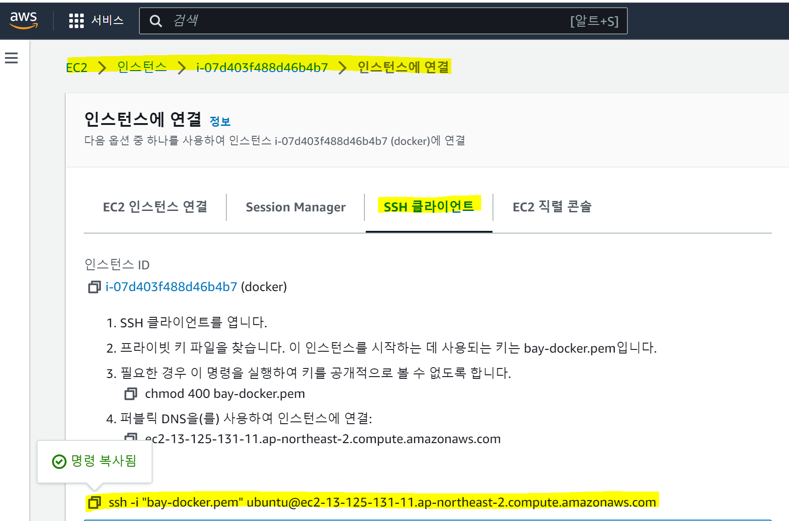

>  AWS 는 클라우드에서 인스턴스를 제공받아 사용하는 EC2 서비스를 제공한다. 


## ssh 이용해서 터미널 접속하기

- 

  접속을 원하는 EC2의 '인스턴스 연결' 페이지에서 SSH 클라이언트 탭을 선택한다

  하단의 ssh 접속 명령어를 복사한다

- 터미널에 접속해 `.pem` 키가 위치한 local directory 로 이동한 후 복사한 명령어를 입력해주면 접속 가능

  ```bash
  cd C:\Users\yoojin\Downloads #.pem 키 위치로 이동
  
  C:\Users\yoojin\Downloads>ssh -i "bay-docker.pem" ubuntu@ec2-13-125-131-11.ap-northeast-2.compute.amazonaws.com
  Welcome to Ubuntu 22.04.2 LTS (GNU/Linux 5.15.0-1031-aws x86_64)
  ```

## Docker 설치하기

- 우선, 터미널에서 `sudo` 를 매번 입력해주기 귀찮으니까 아래의 명령어를 날린다.

  ```bash
  ubuntu@ip-172-31-46-94:~$ sudo su
  ```

- 필요한 util 들을 설치한다.

  ```bash
  root@ip-172-31-46-94:/home/ubuntu# sudo apt update
  sudo apt install apt-transport-https
  sudo apt install ca-certificates
  sudo apt install curl
  sudo apt install software-properties-common
  ```

- docker 를 설치한다

  ```bash
  curl -fsSL https://download.docker.com/linux/ubuntu/gpg | sudo apt-key add -
  sudo add-apt-repository "deb [arch=amd64] https://download.docker.com/linux/ubuntu bionic stable"
  sudo apt-get update
  sudo apt-get install docker-ce
  ```

- 설치된 docker version을 확인한다

  ```bash
  root@ip-172-31-46-94:/home/ubuntu# docker -v
  Docker version 23.0.2, build 569dd73
  ```

## 도커 컨테이너 생성

### docker run 으로 생성하기

```bash
docker run -i -t ubunbu:14.04
```

- `docker run` : 컨테이너를 생성하고 실행하는 역할

- `-i` : 컨테이너와 상호(interactive)  입출력을 가능하게 한다.

- `-t` : tty 를 활성화 해서 bash 셸을 사용하도록 함

- `ubuntu:14.04` : 컨테이너를 생성하기 위한 이미지

  ```bash
  #실행결과
  root@ip-172-31-46-94:/home/ubuntu# docker run -i -t ubuntu:14.04
  Unable to find image 'ubuntu:14.04' locally
  14.04: Pulling from library/ubuntu
  2e6e20c8e2e6: Pull complete
  0551a797c01d: Pull complete
  512123a864da: Pull complete
  Digest: sha256:64483f3496c1373bfd55348e88694d1c4d0c9b660dee6bfef5e12f43b9933b30
  Status: Downloaded newer image for ubuntu:14.04
  
  ```

  ubuntu:14.04 이미지가 로컬 도커 엔진에 존재하지 않아, 도커 허브에서 자동으로 이미지가 내려받아진다.

- docker 내부에서 나오기 위해서는 터미널에 `exit` 를 입력해도 되지만, 이럴 경우 도커 컨테이너 자체도 종료되므로, 개발하다 중간에 잠깐 나오고 싶으면 `Ctrl + P 혹은 Ctrl + Q` 를 눌러서 나오면 정지하지 않고 나올 수 있다.

  ```bash
  root@ip-172-31-46-94:/home/ubuntu# docker ps #실행중인 docker 리스트 확인하는 명령어
  CONTAINER ID   IMAGE          COMMAND       CREATED          STATUS          PORTS     NAMES
  3c64614582c3   ubuntu:14.04   "/bin/bash"   37 seconds ago   Up 36 seconds             sleepy_easley
  ```

### docker create 명령어로 생성하기

```bash
docker create -i -t --name mycontainer centos:7
```

- 이번에는 centos:7 이미지로 도커 컨테이너를 생성해본다.

```bash
#실행결과
root@ip-172-31-46-94:/home/ubuntu# docker create -i -t --name mycontainer centos:7
Unable to find image 'centos:7' locally
7: Pulling from library/centos
2d473b07cdd5: Pull complete
Digest: sha256:be65f488b7764ad3638f236b7b515b3678369a5124c47b8d32916d6487418ea4
Status: Downloaded newer image for centos:7
39469faf121c5e3ba7bf4680b6036872383db2b83f21679ac47c59479c823063
root@ip-172-31-46-94:/home/ubuntu#
```

- docker create 는 생성만 하고 실행은 하지 않기 때문에 `start` 명령어와 `attach` 명령어를 이용해 컨테이너 내부로 들어간다

  ```bash
  root@ip-172-31-46-94:/home/ubuntu# docker start mycontainer
  mycontainer
  root@ip-172-31-46-94:/home/ubuntu# docker attach mycontainer
  [root@39469faf121c /]#
  ```

**✔ `docker create` 명령어와 `docker run` 명령어 차이점**

> -  create 명령어는 컨테이너를 생성만 할 뿐 컨테이너 내부로는 들어가지 않기 때문에 **보통은 `run` 명령어를 더 많이 쓴다.** 
> - `run` 명령어 
>   - docker pull (이미지가 없을 때)  > docker create > docker start > docker attach
> - `create` 명령엉
>   - docker pull(이미지가 없을 때) > docker create

## 도커 컨테이너 목록 확인

지금까지 생성한 컨테이너의 목록을 확인한다

```bash
docker ps
```

```bash
root@ip-172-31-46-94:/home/ubuntu# docker ps
CONTAINER ID   IMAGE          COMMAND       CREATED      STATUS      PORTS     NAMES
39469faf121c   centos:7       "/bin/bash"   6 days ago   Up 6 days             mycontainer
3c64614582c3   ubuntu:14.04   "/bin/bash"   6 days ago   Up 6 days             sleepy_easley
```

- `docker ps` 명령어는 정지되지 않은 컨테이너만 출력한다. 
- 정지된 컨테이너를 포함한 모든 컨테이너를 출력하려면 `-a` 옵션을 준다.

```bash
docker ps -a
```

```bash
root@ip-172-31-46-94:/home/ubuntu# docker ps -a
CONTAINER ID   IMAGE          COMMAND       CREATED      STATUS                    PORTS     NAMES
39469faf121c   centos:7       "/bin/bash"   6 days ago   Up 6 days                           mycontainer
3c64614582c3   ubuntu:14.04   "/bin/bash"   6 days ago   Up 6 days                           sleepy_easley
7f62c24d0fb7   ubuntu:14.04   "/bin/bash"   6 days ago   Exited (127) 6 days ago             gallant_rosalind
```

- STATUS 항목에서 컨테이너의 상태를 확인 할 수 있다.
  - Up : 실행중인 상태
  - Exited : 정지된 상태

## 컨테이너 삭제

rm 명령어를 이용해서 도커를 삭제한다. 한 번 삭제한 도커는 다시 살릴 수 없다.

```bash
docker rm sleepy_easley
```

```bash
root@ip-172-31-46-94:/home/ubuntu# docker ps -a
CONTAINER ID   IMAGE          COMMAND       CREATED      STATUS                    PORTS     NAMES
39469faf121c   centos:7       "/bin/bash"   6 days ago   Up 6 days                           mycontainer
3c64614582c3   ubuntu:14.04   "/bin/bash"   6 days ago   Up 6 days                           sleepy_easley
7f62c24d0fb7   ubuntu:14.04   "/bin/bash"   6 days ago   Exited (127) 6 days ago             gallant_rosalind
root@ip-172-31-46-94:/home/ubuntu# docker rm sleepy_easley
Error response from daemon: You cannot remove a running container 3c64614582c35e908a1e13d2092eada25236d655b92678b47f55c57e0a5602e0. Stop the container before attempting removal or force remove
root@ip-172-31-46-94:/home/ubuntu# docker ps -a
CONTAINER ID   IMAGE          COMMAND       CREATED      STATUS                    PORTS     NAMES
39469faf121c   centos:7       "/bin/bash"   6 days ago   Up 6 days                           mycontainer
3c64614582c3   ubuntu:14.04   "/bin/bash"   6 days ago   Up 6 days                           sleepy_easley
7f62c24d0fb7   ubuntu:14.04   "/bin/bash"   6 days ago   Exited (127) 6 days ago             gallant_rosalind
```

위와 같이 도커가 실행중인(Up) 상태라면  바로 삭제 할 수 없고, `Error response from daemon: You cannot remove a running container 3c64614582c35e908a1e13d2092eada25236d655b92678b47f55c57e0a5602e0. Stop the container before attempting removal or force remove` 에러를 받는다.

이처럼 실행중인 도커를 바로 삭제하고자 하면 `-f` 옵션을 주어 컨테이너 삭제를 강제할 수 있다.

```bash
docker rm -f sleepy_easly
```

```bash
root@ip-172-31-46-94:/home/ubuntu# docker rm -f sleepy_easley
sleepy_easley
root@ip-172-31-46-94:/home/ubuntu# docker ps -a
CONTAINER ID   IMAGE          COMMAND       CREATED      STATUS                    PORTS     NAMES
39469faf121c   centos:7       "/bin/bash"   6 days ago   Up 6 days                           mycontainer
7f62c24d0fb7   ubuntu:14.04   "/bin/bash"   6 days ago   Exited (127) 6 days ago             gallant_rosalind
```

또는 `stop` 명령을 이용해서 docker 를 정지시킨 후 지울 수 있다.

```bash
root@ip-172-31-46-94:/home/ubuntu# docker ps -a
CONTAINER ID   IMAGE          COMMAND       CREATED      STATUS                    PORTS     NAMES
39469faf121c   centos:7       "/bin/bash"   6 days ago   Up 6 days                           mycontainer
7f62c24d0fb7   ubuntu:14.04   "/bin/bash"   6 days ago   Exited (127) 6 days ago             gallant_rosalind
root@ip-172-31-46-94:/home/ubuntu#
root@ip-172-31-46-94:/home/ubuntu#
root@ip-172-31-46-94:/home/ubuntu# docker ps -a
CONTAINER ID   IMAGE          COMMAND       CREATED      STATUS                    PORTS     NAMES
39469faf121c   centos:7       "/bin/bash"   6 days ago   Up 6 days                           mycontainer
7f62c24d0fb7   ubuntu:14.04   "/bin/bash"   6 days ago   Exited (127) 6 days ago             gallant_rosalind
root@ip-172-31-46-94:/home/ubuntu# docker stop mycontainer
mycontainer
root@ip-172-31-46-94:/home/ubuntu# docker ps -a
CONTAINER ID   IMAGE          COMMAND       CREATED      STATUS                       PORTS     NAMES
39469faf121c   centos:7       "/bin/bash"   6 days ago   Exited (137) 8 seconds ago             mycontainer
7f62c24d0fb7   ubuntu:14.04   "/bin/bash"   6 days ago   Exited (127) 6 days ago                gallant_rosalind
root@ip-172-31-46-94:/home/ubuntu# docker rm mycontainer
mycontainer
root@ip-172-31-46-94:/home/ubuntu# docker ps -a
CONTAINER ID   IMAGE          COMMAND       CREATED      STATUS                    PORTS     NAMES
7f62c24d0fb7   ubuntu:14.04   "/bin/bash"   6 days ago   Exited (127) 6 days ago             gallant_rosalind
```

전체 docker 목록을 삭제하고 싶으면 `prune` 명령어를 사용하면 된다.

```bash
root@ip-172-31-46-94:/home/ubuntu# docker container prune
WARNING! This will remove all stopped containers.
Are you sure you want to continue? [y/N] y
Deleted Containers:
7f62c24d0fb71ec79d375ce228d167ed12d26d2d285982070c74526800628665

Total reclaimed space: 13B
root@ip-172-31-46-94:/home/ubuntu# docker ps -a
CONTAINER ID   IMAGE     COMMAND   CREATED   STATUS    PORTS     NAMES
```


