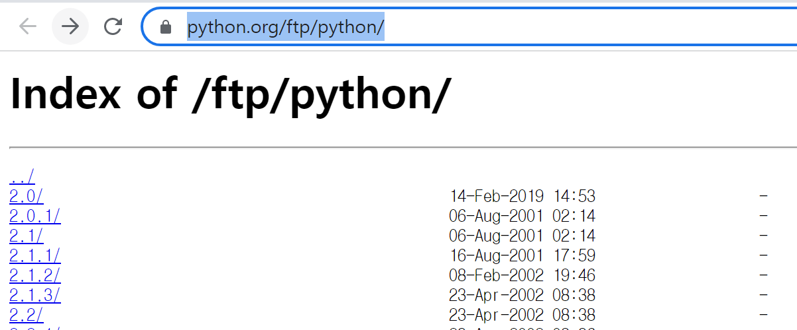
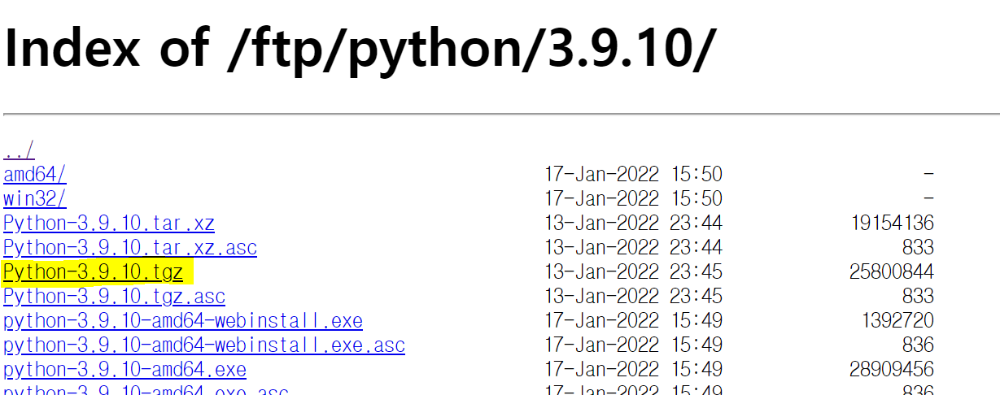

>  pip를 통해 Python을 설치할 수도 있지만, 가끔 특정 버전을 지정해서 python을 설치를 할 필요가 있다. 그럴 경우 아래의 방법으로 설치를 진행한다.

AWS EC2 및 Docker 설치 방법은 아래의 Post 를 참고한다.

✔[AWS에 Docker 설치하기](https://cloudy-bay.github.io/dev/docker/basic/2023-03-31-Docker-install-on-AWS/)

## sudo 설정

귀찮으니까 아래의 명령어 부터 실행

```bash
sudo su
```

## wget 설치

본인 docker 환경에서 아래의 명령어를 수행해 `wget` 을 설치한다.

```bash
apt install -y build-essential zlib1g-dev libncurses5-dev libgdbm-dev libnss3-dev libssl-dev libreadline-dev libffi-dev wget
```

## 원하는 Python 버전 찾기

- 아래의 경로에서 원하는 python version 을 찾아서 들어간다. 난 python3.9.10 version 을 설치할 예정.

  https://www.python.org/ftp/python/

  

- 원하는 버전의 `.tgz` 파일위에서 **마우스 오른쪽 클릭 > 링크 주소 복사**

  

## docker 에 python 설치

wget 명령어 뒤에 위에서 복사한 링크 주소를 붙여넣고 실행

```bash
wget https://www.python.org/ftp/python/3.9.10/Python-3.9.10.tgz
```

설치예시

```bash
root@8fa9356600f6:/# wget https://www.python.org/ftp/python/3.9.10/Python-3.9.10.tgz
--2023-04-08 09:56:57--  https://www.python.org/ftp/python/3.9.10/Python-3.9.10.tgz
Resolving www.python.org (www.python.org)... 146.75.48.223, 2a04:4e42:7c::223
Connecting to www.python.org (www.python.org)|146.75.48.223|:443... connected.
HTTP request sent, awaiting response... 200 OK
Length: 25800844 (25M) [application/octet-stream]
Saving to: 'Python-3.9.10.tgz'

100%[==============================================================================>] 25,800,844   134MB/s   in 0.2s

2023-04-08 09:56:57 (134 MB/s) - 'Python-3.9.10.tgz' saved [25800844/25800844]
```

## tar 파일 압축 해제 및 해제된 경로로 이동

``` bash
tar xzf {다운로드 한 python tgz 파일명}
cd {다운로드 한 python tgz 파일명}
```

- x : 압축해제
- z : gzip 압축해제
- f : 파일이름 지정

예제

```bash
root@8fa9356600f6:/# tar xzf Python-3.9.10.tgz
root@8fa9356600f6:/# ls -lrt
total 25280
drwxr-xr-x   2 root root     4096 Apr 10  2014 mnt
drwxr-xr-x   2 root root     4096 Apr 10  2014 home
drwxr-xr-x   2 root root     4096 Apr 10  2014 boot
drwxr-xr-x   1 root root     4096 Dec 17  2019 usr
drwxr-xr-x   2 root root     4096 Dec 17  2019 srv
drwxr-xr-x   2 root root     4096 Dec 17  2019 opt
drwxr-xr-x   2 root root     4096 Dec 17  2019 media
drwxr-xr-x   2 root root     4096 Dec 17  2019 lib64
drwxr-xr-x   1 root root     4096 Dec 17  2019 var
drwx------   2 root root     4096 Dec 17  2019 root
drwxr-xr-x   2 root root     4096 Dec 17  2019 bin
drwxr-xr-x   1 root root     4096 Mar 25  2021 sbin
drwxr-xr-x   1 root root     4096 Mar 25  2021 run
drwxrwxr-x  16 1000 1000     4096 Jan 13  2022 Python-3.9.10
-rw-r--r--   1 root root 25800844 Jan 13  2022 Python-3.9.10.tgz
dr-xr-xr-x 169 root root        0 Apr  8 09:34 proc
dr-xr-xr-x  13 root root        0 Apr  8 09:34 sys
drwxr-xr-x   5 root root      360 Apr  8 09:34 dev
drwxrwxrwt   1 root root     4096 Apr  8 09:46 tmp
drwxr-xr-x   1 root root     4096 Apr  8 09:46 lib
drwxr-xr-x   1 root root     4096 Apr  8 09:46 etc
root@8fa9356600f6:/# cd Python-3.9.10
root@8fa9356600f6:/Python-3.9.10#
```

## 빌드

```bash
./configure --enable-optimizations
```

최적화 된 build 를 진행하겠다라는 옵션인데, 관심있으신 분은 아래의 글을 정독해 보시는 것도..?

> This flag enables Profile guided optimization (PGO) and Link Time Optimization (LTO).
>
> Both are expensive optimizations that slow down the build process but yield a significant speed boost (around 10-20% from what I remember reading).
>
> The discussion of what these *exactly do* is beyond my knowledge and probably too broad for a single question. Either way, you can read a bit about LTO from the [the docs on GCC which has an implementation for it](https://gcc.gnu.org/onlinedocs/gccint/LTO-Overview.html) and get a start on PGO by reading [its wiki page](https://en.wikipedia.org/wiki/Profile-guided_optimization).

그다음 make 명령어를 통해 설치를 완료한다.

```bash
make 
make altinstall
```

python 공식문서에 따르면 `make install` option 은 python binary 를 덮어쓸 수 있다니 altinstall 옵션으로 수행해주었다.

>  Warning
>
> `make install` can overwrite or masquerade the `python3` binary. `make altinstall` is therefore recommended instead of `make install` since it only installs `*exec_prefix*/bin/python*version*`.


# 참고

- https://docs.python.org/3/using/unix.html?highlight=altinstall#building-python

- https://projooni.tistory.com/entry/Linuxubuntu%EC%97%90%EC%84%9C-Python-%ED%8A%B9%EC%A0%95%EB%B2%84%EC%A0%84-%EC%84%A4%EC%B9%98%ED%95%98%EA%B8%B0

  


